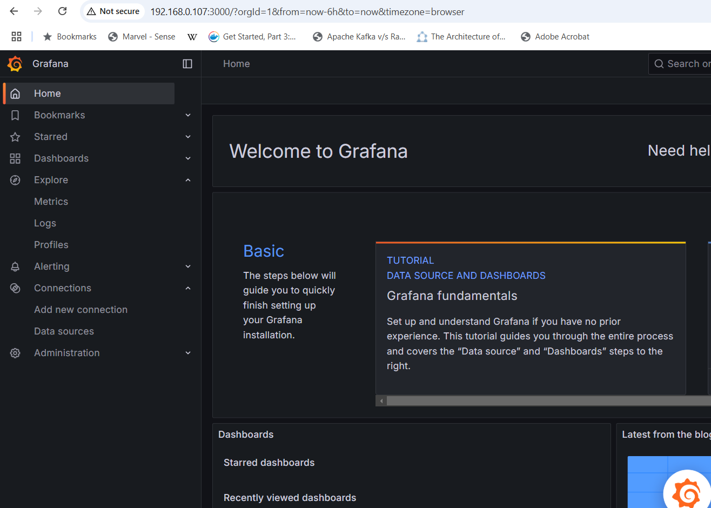
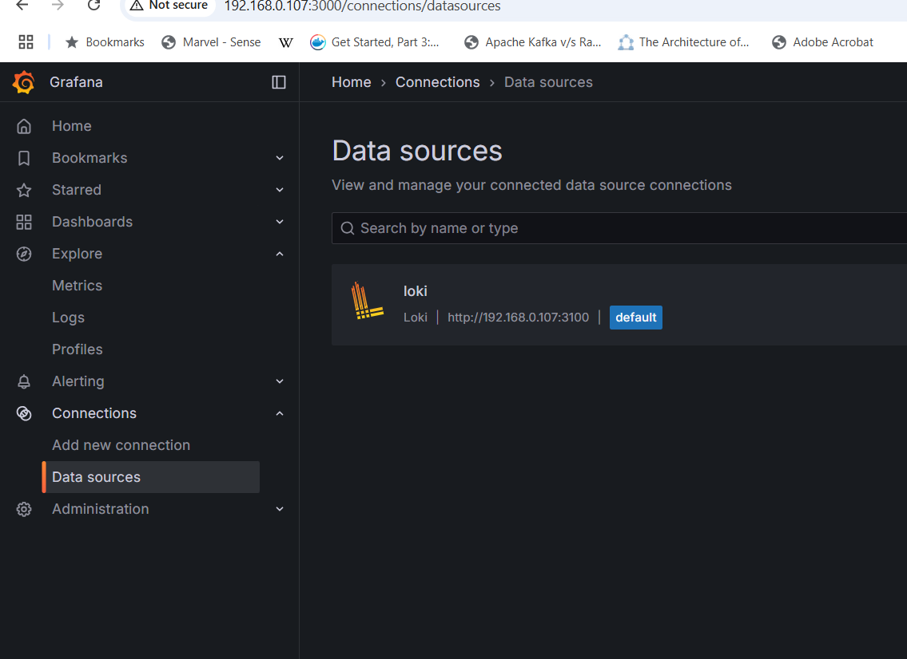
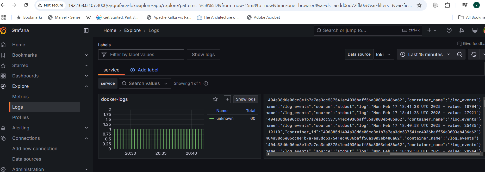

# Lesson 6

Create a bridge network for out infrastructure:
```
docker network create --driver bridge robotdreams
```

Building an image for a Fluentd service and running a container the Fluentd service:
```
docker build -t fluentd-loki -f Dockerfile_fluentd .

docker run -d --name fluentd \
  --network robotdreams \
  -v $(pwd)/fluentd.conf:/fluentd/etc/fluent.conf \
  -p 24224:24224 -p 24224:24224/udp \
  fluentd-loki
```

Running a container generates logs:
```
docker run -d --name log_events \
  --network robotdreams \
  --log-driver=fluentd --log-opt fluentd-address=localhost:24224 \
  busybox sh -c 'while true; do echo "$(date) - value: $RANDOM"; sleep 15; done'
```

Running a Loki service:
```
docker run -d --name loki --network robotdreams -p 3100:3100 grafana/loki:3.4
```

Running a Grafana service
```
docker run -d --name grafana  --network robotdreams -p 3000:3000 -e GF_SECURITY_ADMIN_PASSWORD=admin -e "GF_DASHBOARD_DEFAULT_HOME_DASHBOARD_PATH=/etc/grafana/dashboards/default-dashboard.json" -e GF_SERVER_ROOT_URL=http://localhost:3000 -v $(pwd)/provisioning:/etc/grafana/provisioning grafana/grafana:11.5.1
```

Checking log events in the Grafana dashboard:


Adding a Loki data source:


Log events:


